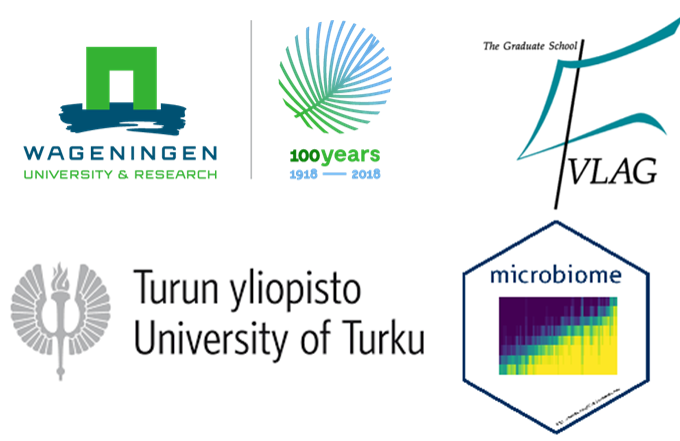
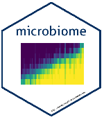

  

# Introduction  

  

Three day spring school on basics of high throughput 16S rRNA gene sequencing data analysis. This spring school is organised in collaboration with [VLAG graduate school](https://www.vlaggraduateschool.nl/en.htm), [Laboratory of Microbiology](https://www.wur.nl/en/Expertise-Services/Chair-groups/Agrotechnology-and-Food-Sciences/Laboratory-of-Microbiology.htm), [Systems and Synthetic Biology](https://www.wur.nl/en/Expertise-Services/Chair-groups/Agrotechnology-and-Food-Sciences/Laboratory-of-Systems-and-Synthetic-Biology.htm), Wageningen University & Research, the Netherlands and [Department of Mathematics and Statistics University of Turku](https://www.utu.fi/en/units/sci/units/math/Pages/home.aspx), Finland. This year it will be held at [Wageningen University & Research](https://www.wur.nl/en.htm). We will cover topics related to basics of sequencing and microbial community analysis. We will use [NG-Tax]( https://f1000research.com/articles/5-1791/v1) and [R](https://www.r-project.org/) based tools like [Phyloseq](http://journals.plos.org/plosone/article?id=10.1371/journal.pone.0061217), [microbiome](http://microbiome.github.io/microbiome/) and [ggplot2](http://ggplot2.org/) for downstream data analysis and visualization.   

## Preparing for the course

We recommend using your own laptop. If this is not possible, kindly contact the organizers.

Install the following software before the course, if possible:

* [R version 3.4](https://www.r-project.org/)   
* [R Studio](https://www.rstudio.com/)   
* [phyloseq](http://journals.plos.org/plosone/article?id=10.1371/journal.pone.0061217)  
* [microbiome](http://microbiome.github.io/microbiome/)  
* [ggplot2](http://ggplot2.org/)   
* [R graphics cookbook](http://www.cookbook-r.com/Graphs/)  

The materials for the summer school will be made available through this website soon.       
The script to set-up the RStudio environment with required package installations can be found in the folder named `scripts`.  

**Useful links**  

* [RMarkdown](https://rmarkdown.rstudio.com/)   
* [List of R tools for microbiome analysis](https://microsud.github.io/Tools-Microbiome-Anlaysis/)   

## Useful functions   

* [Base R](https://www.rstudio.com/wp-content/uploads/2016/10/r-cheat-sheet-3.pdf)  
* [R Markdown](https://www.rstudio.com/wp-content/uploads/2016/03/rmarkdown-cheatsheet-2.0.pdf)  
* [RStudio IDE](https://www.rstudio.com/wp-content/uploads/2016/01/rstudio-IDE-cheatsheet.pdf)  
* [ggplot2](https://www.rstudio.com/wp-content/uploads/2016/11/ggplot2-cheatsheet-2.1.pdf)  

